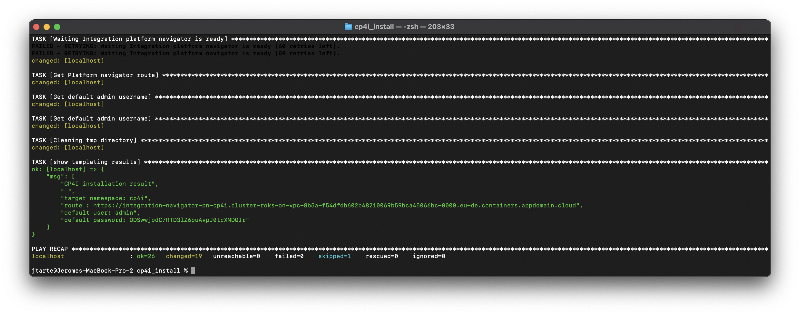

# IBM Cloud Pak for Integration installation Ansible script

This repository contains ansible scripts and associated resources to install / uninstall IBM Cloud Pak for Integration(CP4I) on an Openshift Container Platform (OCP).

The installation script includes the following steps:
* Upload the IBM catalog
* Create the installation target namespace (if not existing)
* Deploy the CP4I operators (all the operators or a selection of operators). This installation could be done with a cluste scope or a namespace scope.
* Create the entitlment secret in the target namespace if the entitlment key should be managed at namespace level. For cluster level, refer to CP4I knowloedge center and apply it before to launch the script. 
* Create an instance of CP4I Platform Navigator. This deployment will generate the deployment of IBM Cloud Pak foundational Services and IBM Automation foundation (Integration Cartridge).  

## Prerequisites

* Ansible runtime on the environment where the script will be ran. 
* An exisiting OCP instance. 
* Storage provider that will be used by CP4I installed on OCP. 
* An active OCP cli session (`oc login`) with an user having `cluster-admin` privileges.

The script has been tested with CP4I v2021.2 on OCP 4.7 with OCS 4.7. 

## Installation
1. Clone this git repository
   ``` 
   git clone git@github.com:jtarte/cp4i_install_ansible.git
   ``` 
2. Go inside the created directory
   ```
   cd cp4i_install_ansible
   ```

3. Create an `config.json` file using the `config.json_sample` sample file
   ```
   cp config.json_sample config.json
   ```

4. Edit (with yur prefered editor) the `config.json` file and update the values to reflect the installation configuration you are targeting. 

5. Launch the execution of the ansible script
   ```
   ansible-playbook -i inventory install.yaml -e config_file=config.json
   ```

If the installation is successful, you should get a success message like the following one:


The success message gives you :
* The route of the CP4I Platform Navigator instance. 
* The admin user (default : `admin`).
* The password of the admin user.

## Parameters for the `config.json` file

The following table describes the values that could be used in `config.json` file.

| name | description | sample value |
| ---- | ----------- | ------------ |  
| entitlement_scope | Define if the CP4I entitlment key is global to a cluster or of it is restrictred to a namespace. In the case of namespace, the targeted namespace is given in `cp4i_namespace` parameter.  | `namespace` or `cluster` |
| cp4i_namespace | The target namespace used  during the installation. If operators have namespace scope, they will be deployed here. This namespace is also used to deploye the Integration Plafform navigator instance.  | `cp4i` |
| operator_scope | Define if the CP4I operators have a global scope( cluster) or are limited to a namespace | `namespace` or `cluster` |
| entitlement_key | The value of your entitlment key. You could get it at [myibm.ibm.com](https://myibm.ibm.com).  | |
| storage_class | The storage class that will be used by the IBM Cloud Pak foundational services. | ocs-storagecluster-cephfs | 
| operators_list | Define if all the CP4I operators are deployed or only a set of selected operators. For all operators, the value should be set at `all`. For a selection of operators, you should provide a tab with the operators list. The accepted values are <ul><li>`api-connect`</li><li>`app-connect`</li><li>`aspera`</li><li>`asset-repository`</li><li>`datapower-gateway`</li><li>`mq`</li><li>`operation-dashboard`</li></ul> | `all` or `["app-connect","mq"]`


## Uninstallation

Launch the execution of the ansible script
```
ansible-playbook -i inventory uninstall.yaml -e config_file=config.json
```

**NB:** The target namespaced may be blocked on *Terminating* state. There are two resources that have a finaliser blocking their delation :
* the rolebinding `admin`in the target naemspace (default value is `cp4i`). 
* the `clients.oidc.secuirty.ibm.com` CRD named `zenclient-cp4i`.

You should modify the values of the finalizers, with `[]` for example, to enforce their removal and to allow the delation of the target namespace. 
